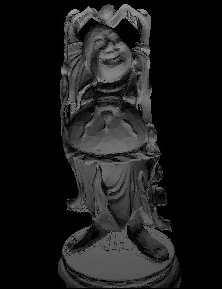

# BIH
A functorial implementation of the bounding interval hierarchy (BIH).

This is a data structure that was quite popular for doing real-time raytracing a few years ago.
It should be usable for other purposes though.

In lib_test, a raytracing example is provided, reyling on the BIH for fast ray-tracing.
You should see something like this appear a few seconds after running the program:

